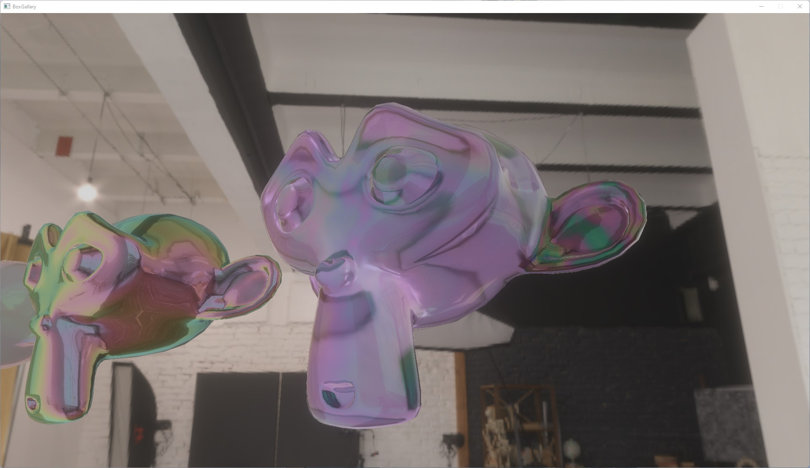

# BoxGallary
BoxGallary collects rendered images from my real-time renderer(C++). It aims for supporting all features in [glTF](https://github.com/KhronosGroup/glTF) such as PBR.

Chess showcases of [KHR_materials_volume](https://github.com/KhronosGroup/glTF/blob/main/extensions/2.0/Khronos/KHR_materials_volume/README.md), [KHR_materials_transmission]https://github.com/KhronosGroup/glTF/tree/main/extensions/2.0/Khronos/KHR_materials_transmission)

The dragon features transmission and volume where different thickness leads to different attenuation (colour appears yellowish at foot).

Iridescence is the effect of light interference due to thin film layers. Below features Suzanne with iridescence (rainbow colour), transmission and volume (refraction). The left Suzanne has a high metallic value, 400nm thin-film layer thickness value. 

The left Suzanne with 550nm thin-film layer thickness value while the right Suzanne has purple attenuation colour. 

Postprocessing effect of physical bloom. 

